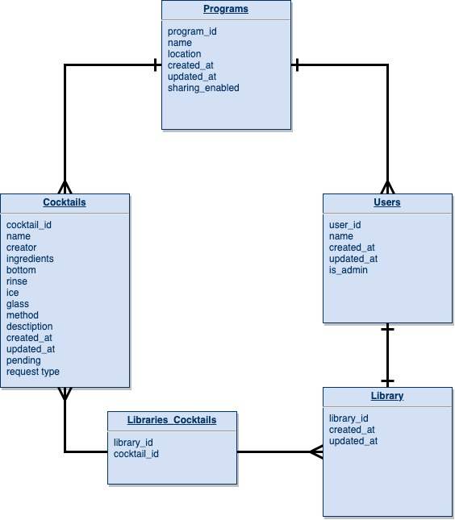

## Overview

_**The Tome** is a searchable, community-driven cocktail database. Optimized to run on a restaurant POS tablet, this app will allow users to view a complete collection of cocktail recipes from their bar program, build their own library of recipes, and submit new cocktails as well as giving beverage directors and owners the option of sharing their recipes into the cloud in exchange for access to the recipes of other programs that have enabled sharing._

 

## MVP

_**The Tome** MVP will encompass:_

# Server (Back End)

    *Build a RESTful JSON API.
        **Build a Ruby on Rails server, exposing RESTful JSON endpoints.
        **Build a database with at tables as defined in the ERD:
        **Implement working generic controller actions for Full CRUD (index, show, **create, update, delete) between non-User tables

# Client (Front End)

    *Build a working, interactive React app.
    **Consume data from Rails API, and render that data in components.
    **Utilize React Router, for client-side routing.
    **Demonstrate Full CRUD actions on the front end.

# Styling

    **Style with CSS Flexbox and Grid.
    **Implement 2 media queries for responsive design on 3 screen sizes (including desktop).

# Linting

    **Indent properly.
    **Utilize high-quality, semantic variable names.
    **Follow camelCase, snake_case, and kebab-case convention.
    **Remove unnecessary boilerplate React files and code.
    **Remove all console.log()s and commented out code.

# Deployment

    **Deploy the fully functional front-end via Surge or Netlify.
    **Deploy the back-end via Heroku.
 

 

### Goals

- _Skeleton FE, BE, and database appropriately_
- _Achieve full CRUD_
- _Build out short but comprehensive seed data file_
- _Style for minimalist chic esthetic_
- _Implement user libraries_
- _Implement pending changes/admin approval for edit & delete_
- _App is easy to use and intuitive_

 

### Libraries and Dependencies

> Use this section to list all supporting libraries and dependencies, and their role in the project. Below is an example - this needs to be replaced!

|     Library      | Description                                |
| :--------------: | :----------------------------------------- |
|      React       | _Front End Library_ |
|   React Router   | _Front End Routes_ |
|React Transitions | _Front End Transitions_ |
|      Rails       | _Back End Framework_ |
|      Bcrypt      | _Authentication_ |

 

### Client (Front End)

#### Wireframes

#### Component Tree

#### Time Estimates

> Use this section to estimate the time necessary to build out each of the components you've described above.

| Task                | Priority | Estimated Time | Time Invested | Actual Time |
| ------------------- | :------: | :------------: | :-----------: | :---------: |
| Skeleton Rails/React|    H     |     6 hrs      |     0 hrs     |     TBD     |
| Create Seed Data    |    H     |     6 hrs      |     0 hrs     |     TBD     |
| Test CRUD endpoints |    H     |     4 hrs      |     0 hrs     |     TBD     |
| Style screens       |    H     |     8 hrs      |     0 hrs     |     TBD     |
| Implement Libraries |    L     |     4 hrs      |     0 hrs     |     TBD     |
| Implement Pending   |    L     |     4 hrs      |     0 hrs     |     TBD     |
| Streamline and debug|    L     |     6 hrs      |     0 hrs     |     TBD     |
| TOTAL               |          |    38 hrs      |     0 hrs     |     TBD     |

 

### Server (Back End)

#### ERD Model

***

## Post-MVP

> User Authentication, Password Reset, User Icons

***

## Code Showcase

> Can't wait to have something to put here!

## Code Issues & Resolutions

> I will resolve the heck out of some issues to put here.