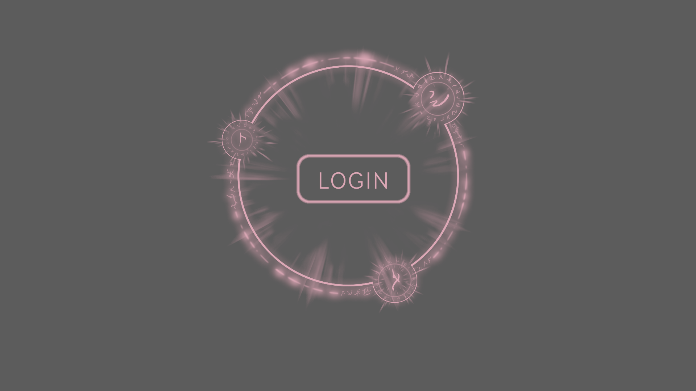
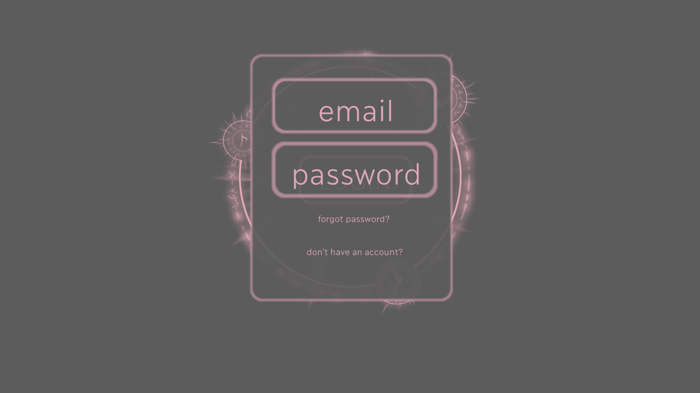
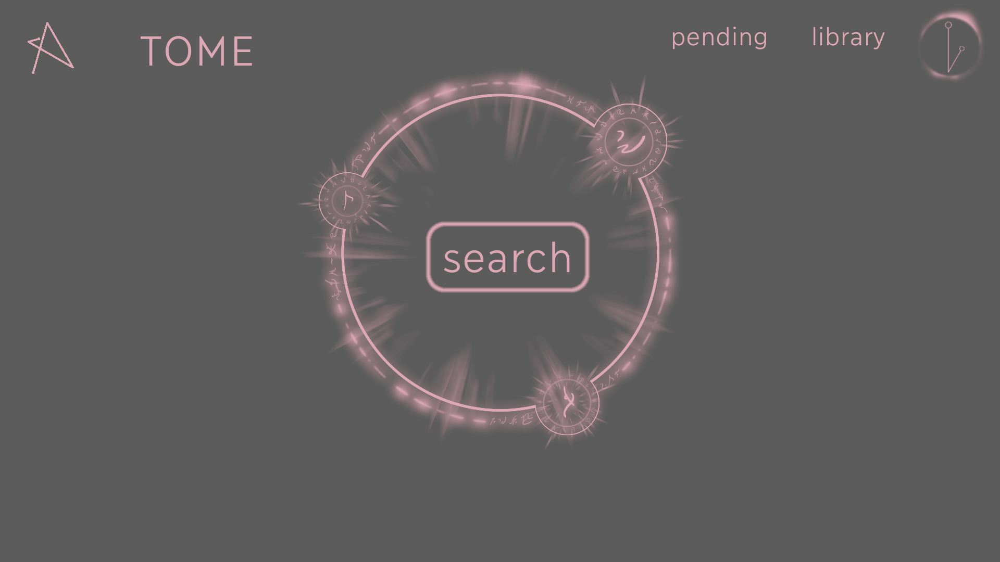
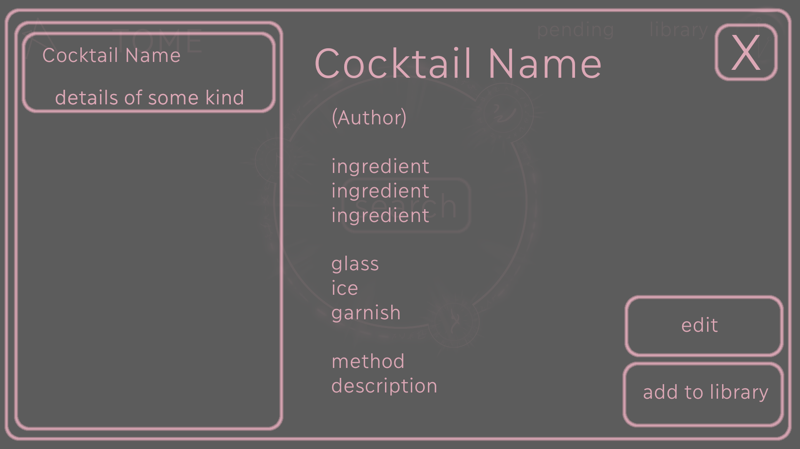
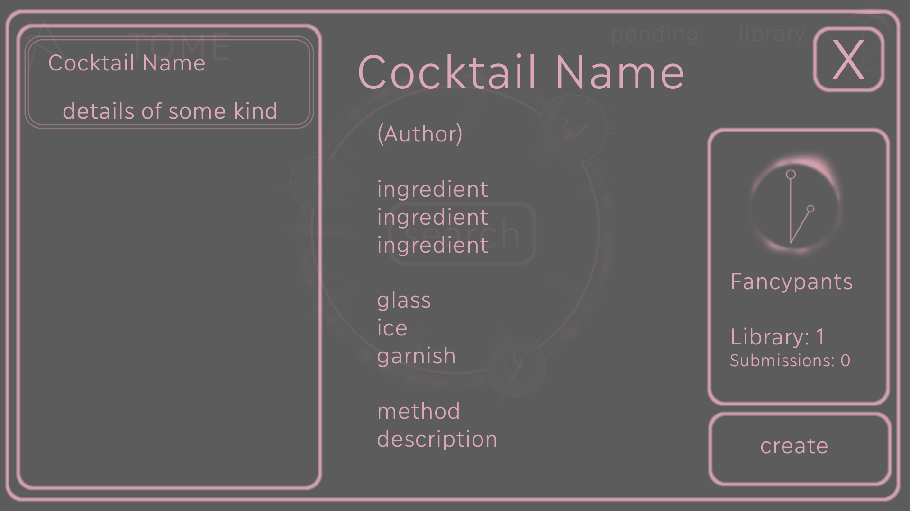
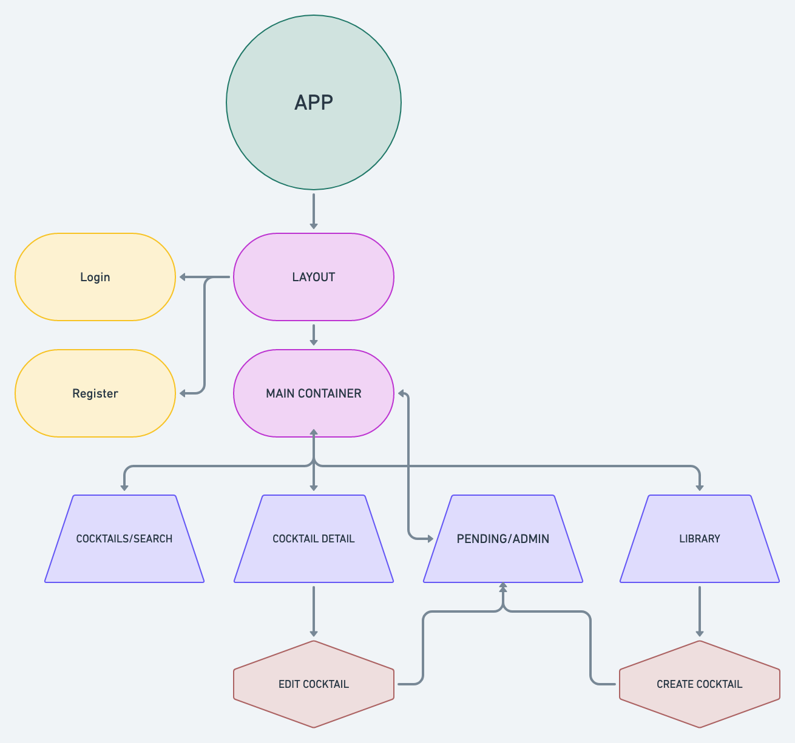

## Overview

_**The Tome** is a searchable, community-driven cocktail database. Optimized to run on a restaurant POS tablet, this app will allow users to view a complete collection of cocktail recipes from their bar program, build their own library of recipes, and submit new cocktails as well as giving beverage directors and owners the option of sharing their recipes into the cloud in exchange for access to the recipes of other programs that have enabled sharing._

 

### Goals (Achieved)

- _Skeleton FE, BE, and database appropriately_
- _Achieve full CRUD_
- _Style for minimalist chic esthetic_

### Goals (Pending)

- _Implement user libraries_
- _Implement pending changes/admin approval for edit & delete_
- _App is easy to use and intuitive_

 

#### Wireframes

#### Component Tree

 
